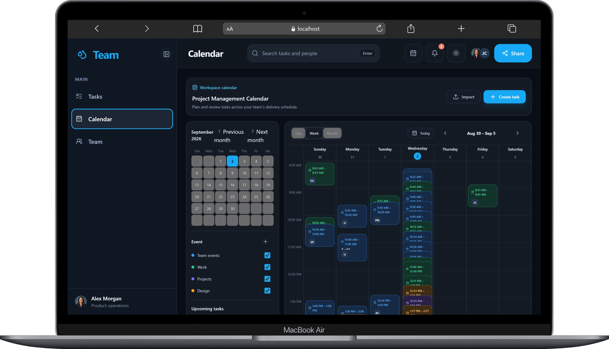
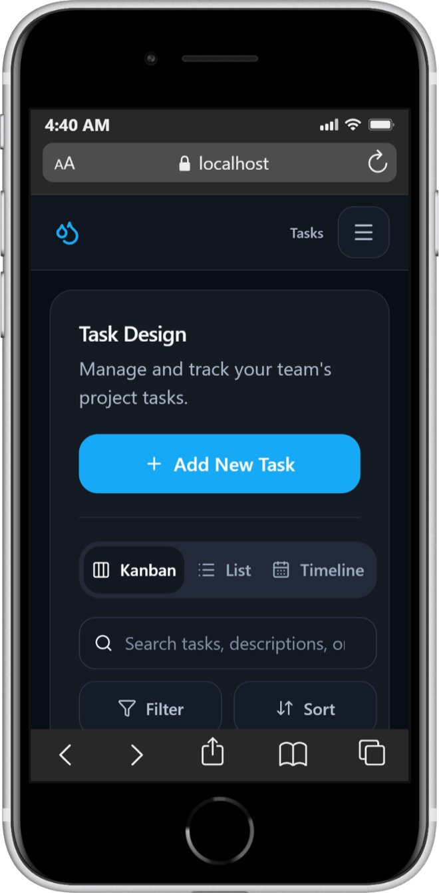
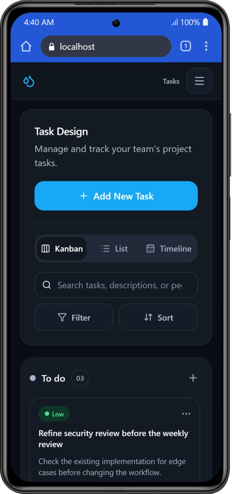
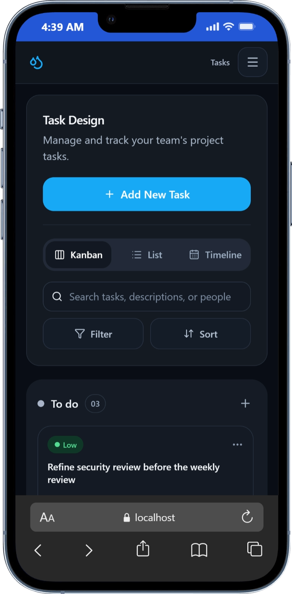

# Team Task System

A responsive React task-management frontend for the WEBNS practical exercise. The product focuses on a team finding, sharing, creating, and moving work quickly; Calendar and Team Management are supporting workspace views built from the same in-memory task domain.

## Run locally

Requirements: Node.js 20+ and npm.

```bash
npm install
npm run dev
```

Open the Vite URL printed in the terminal. The primary route is `/tasks`; supporting routes are `/calendar`, `/team`, and `/tasks/:taskId`.

| Command | Purpose |
| --- | --- |
| `npm run dev` | Start the development server. |
| `npm run build` | Type-check and create a production build. |
| `npm run lint` | Run Oxlint. |
| `npm run test` | Run the Vitest suite. |
| `npm run preview` | Serve the production build locally. |

## What is built

- 360 deterministic task fixtures with long titles, missing descriptions, no-owner/no-date tasks, overdue/today/future dates, and varied priorities.
- Fast task and assignee search, status/priority/owner/due-date filters, sorting, pagination, and task details.
- Four unambiguous workflow stages: **To do**, **In progress**, **In review**, and **Completed**. Tasks can be moved by Kanban drag-and-drop or the keyboard-accessible status control.
- List, Kanban, and Timeline views from one query result. Pagination is available in every view so Board and Timeline never silently hide the rest of the backlog.
- Loading, error-with-retry, refresh, and empty states; validated task creation; and optimistic status movement with failure feedback.
- URL-backed task views. Search, filters, sorting, pagination, and view are shareable, for example: `/tasks?status=review&priority=urgent&sort=title&direction=desc&page=2&view=board`.
- Responsive layouts for 1280px desktop, 768px tablet, and 375px mobile. The task List becomes cards, the Timeline becomes stacked task rows, the Calendar uses a focused day view on compact screens, and the Team List uses cards instead of a scrollable table.
- A Team Management directory with Board/List modes, shareable URL-backed search/department/page/view state, CSV export, employee creation, selection, and an inspector. Zustand owns ephemeral UI state; URL query parameters own shareable directory state.
- Employee Details pages at `/team/:employeeId`, linked from the Team Board and List, with editable profile fields, contact actions, work/personal information, and honest text-document downloads.
- New employees are registered as task assignees immediately, so the Task form and task search use the same source of team members.

## Data model and boundaries

`Task` contains an id, title, optional description, status, priority, optional assignee id, optional due date, created/updated timestamps, and position within a workflow column. `TeamMember` contains an id, name, and email. The Team Management directory extends this with employee-specific profile fields and a `taskMemberId` that connects each employee to the shared assignee model.

The mock API in `src/features/tasks/api/task-service.ts` is the only layer that reads or mutates task fixtures. It mimics asynchronous requests and keeps changes for the browser session. This makes a future HTTP API replacement localized to that boundary.

The application is intentionally frontend-only. There is no authentication, server persistence, real-time collaboration, comments, attachments, or production calendar import yet. The Calendar import button only acknowledges a selected `.csv` or `.ics` file; it does not parse or persist it. These limits keep the submission focused on the requested task workflow rather than presenting unsupported features as complete.

## Product decisions

The default is Kanban because the main job is moving work through clear stages. The List supports fast dense scanning, while the Timeline makes due-date distribution easier to understand without introducing another data source. Status, priority, ownership, and due-date signals are kept close to the task rather than moved into a separate dashboard.

Shareable state belongs in the URL. Search uses history replacement to avoid one history item per keystroke; deliberate filter, sort, pagination, and view changes add normal Back-button history. Zustand is used for transient UI such as dialogs, mobile navigation, selection, sidebar preference, calendar controls, and employee drafts.

The mobile layout makes a deliberate information trade-off: it removes dense multi-column views rather than relying on horizontal scrolling. Important task metadata remains visible in stacked cards and controls retain keyboard focus styling and readable labels.

## Testing and quality checks

The Vitest suite currently contains 8 test files and 16 tests covering task query parsing, task service filtering/search/sort/pagination/errors, task and calendar stores, Team Management URL query handling, employee selection/creation, new-employee assignee registration, and employee-detail data utilities.

Before committing this revision, the following all pass:

```text
npm run build
npm run lint
npm run test
```

## Screenshots

The following local captures show the responsive workspace on desktop and mobile device widths.

### Desktop calendar



### Mobile task workspace







## Least-confident decisions

1. **Kanban as the default:** it makes workflow movement immediate, but a list-first default may be faster for teams doing primarily search and triage.
2. **Compact Calendar as Day-only:** it prevents clipped multi-day columns at tablet and mobile widths, but users who need a weekly overview on a phone may prefer a swipeable agenda instead.
3. **In-memory assignee registration:** it correctly connects Team Management to the task form during a session, but a real application needs a backend identity model and persistence.

## AI usage

Codex was used to inspect the codebase, implement and refactor React/TypeScript/CSS, write focused tests, run build/lint/test checks, and help document product trade-offs. The code, state boundaries, and UX decisions were reviewed so they can be explained and changed during a follow-up interview.
